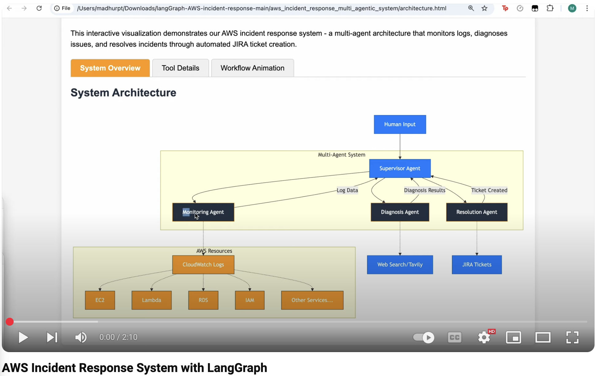
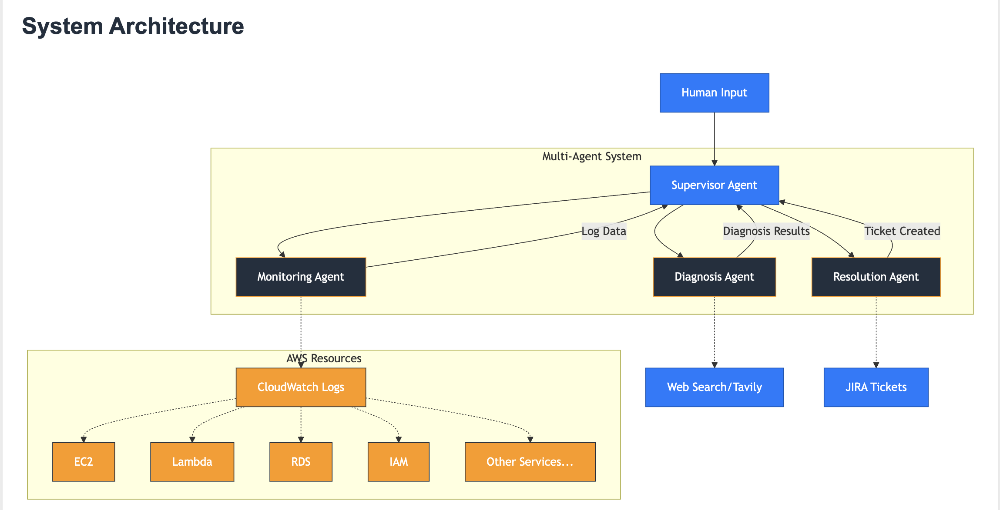

# AWS Incident Response System with LangGraph
Agents are autonomous systems that intelligently accomplish tasks on your behalf, orchestrate plans and execute those plans by breaking them down into sub steps and simpler tasks. These tasks can range from simple workflows to pursuing more complex tasks. In this blog, we will do a walk through of an example that is built using `LangGraph`. 

`LangGraph`, a library within the `LangChain` ecosystem, is a framework for building and managing complex, stateful, multi-agent LLM applications by modeling workflows as graphs, allowing for more flexible and controllable agent architectures. 

[](https://www.youtube.com/watch?v=Yb7hDjDKSR4)

## Technical Walkthrough: Building an Autonomous AWS Incident Response System with LangGraph

This technical walkthrough examines a multi-agent system for autonomous incident response in AWS environments. The system uses LangGraph for orchestration, AWS SDK for service interaction, and LLMs for intelligent decision-making. The solution creates a coordinated workflow of specialized agents that monitor, diagnose, and remediate issues while maintaining communication with stakeholders.



## Installation Instructions
Follow these steps to set up and run the AWS incident response system:

1. Clone the repository

    ```bash
    git clone https://github.com/madhurprash/langGraph-AWS-incident-response.git
    cd langGraph-AWS-incident-response
    ```

2. Install uv (a fast Python package installer)

    ```bash
    curl -LsSf https://astral.sh/uv/install.sh | sh
    export PATH="\$HOME/.local/bin:\$PATH"
    ```

3. Create and activate the Python environment

    ```bash
    uv venv -p python3.12
    source .venv/bin/activate
    uv pip install -r requirements.txt
    ```

4. Set up your API keys
- LangSmith API key
- AWS credentials
- JIRA credentials (if using the ticket creation feature)

5. Set up a Jupyter kernel for the environment

    ```bash
    uv pip install ipykernel zmq
    python -m ipykernel install --user --name=.venv --display-name="Python (AWS Incident Response)"
    ```

6. Run the Jupyter notebook: When the notebook opens, select the "Python (AWS Incident Response)" kernel if it's not automatically selected.

### Architecture Overview

The system consists of four specialized agents working together in a coordinated workflow:

1. **Monitoring Agent**: Checks AWS service status from cloudwatch logs. The user is able to ask questions about any service. For this example, we created a dummy log group and asked questions to check for synthetically made up security and compliance violations, but this can ideally be for any cloudwatch log group.
2. **Diagnosis Agent**: Analyzes root causes of identified issues and looks for remediation strategies using the `tavily_search` tool.
3. **Resolution Agent**: Creates JIRA tickets for remediation based on diagnosis outcomes
4. **Supervisor Agent**: Orchestrates the workflow between the specialized agents

These agents communicate through a shared state managed by LangGraph's StateGraph, enabling a sequential and conditional flow of information and actions.

**Note**: This example is a simple Agentic version of what can be achieved using `LangGraph`. In the same way, this can be iterated for a number of use cases, how this can be used within an MCP server. This blog also shows how you can add on tracing and observability using `Weave` and `LangSmith`.
